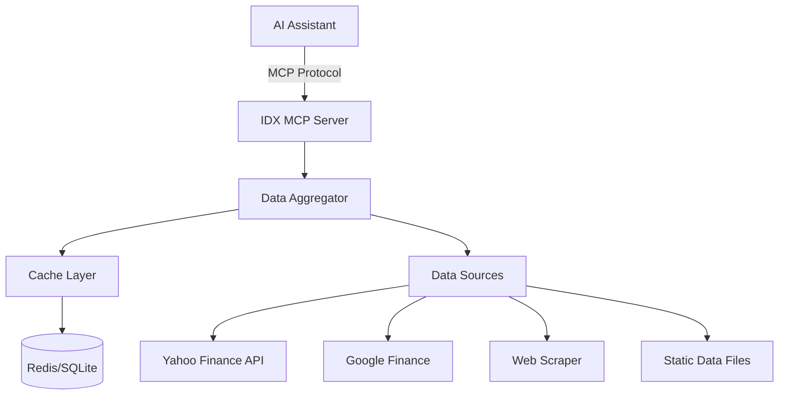

# Product Requirements Document (PRD)
## Indonesian Stock Market MCP Server - DELIVERED v1.0.5

### 1. Executive Summary

**Product Name:** IDX MCP Server (Baguskto Saham)  
**Version:** 1.0.5 (Production Ready)  
**Target Users:** Developers, traders, and financial analysts using AI assistants (Claude, Cursor, ChatGPT)  
**Problem Statement:** No MCP server exists for Indonesian stock market data, forcing users to manually search and copy-paste information from various sources  
**Solution:** ✅ **DELIVERED** - Production-ready MCP server providing comprehensive access to Indonesian stock market data (958 stocks, 2019-2025 historical data) through AI assistants

---

### 2. Goals & Objectives

#### Primary Goals
- Provide first functional MCP server for Indonesian stock market
- Enable AI assistants to access IDX data programmatically
- Establish foundation for comprehensive Indonesian financial data platform

#### Success Metrics
- 100+ active installations within 3 months
- 5,000+ API calls per day
- 80% user retention rate
- <2 second response time for queries

---

### 3. User Personas

#### Persona 1: "Retail Investor Andi"
- **Age:** 25-35, tech-savvy professional
- **Need:** Quick stock analysis while coding/working
- **Pain Point:** Switching between apps to check stock prices
- **Use Case:** "What's BBCA price today?" directly in Cursor

#### Persona 2: "Developer Budi"
- **Age:** 22-40, software engineer
- **Need:** Integrate IDX data into AI workflows
- **Pain Point:** No programmable access to IDX data
- **Use Case:** Building trading bots or analysis tools

#### Persona 3: "Analyst Citra"
- **Age:** 28-45, financial analyst
- **Need:** Quick market insights during research
- **Pain Point:** Manual data gathering from multiple sources
- **Use Case:** "Show me banking sector performance this week"

---

### 4. Functional Requirements

#### 4.1 Core Features (MVP - Phase 1)

##### Feature 1: Market Overview
```yaml
Function: get_market_overview()
Returns:
  - IHSG current value & change
  - Trading volume & value
  - Market status (open/closed)
  - Top 5 gainers/losers
  - Foreign flow summary
```

##### Feature 2: Stock Information
```yaml
Function: get_stock_info(ticker)
Parameters:
  - ticker: Stock code (e.g., "BBCA", "TLKM")
Returns:
  - Current price & change
  - Day's range (high/low)
  - Volume & value
  - 52-week high/low
  - Market cap
  - P/E ratio (if available)
```

##### Feature 3: Historical Data
```yaml
Function: get_historical_data(ticker, period)
Parameters:
  - ticker: Stock code
  - period: "1d", "1w", "1m", "3m", "1y"
Returns:
  - OHLCV data
  - Simple price chart (ASCII/Unicode)
```

##### Feature 4: Sector Performance
```yaml
Function: get_sector_performance()
Returns:
  - All IDX sectors performance
  - Best/worst performing sectors
  - Sector rotation analysis
```

##### Feature 5: Search Stocks
```yaml
Function: search_stocks(query)
Parameters:
  - query: Company name or partial ticker
Returns:
  - Matching stocks list
  - Basic info for each match
```

#### 4.2 Data Intelligence Features

##### Feature 6: Foreign Flow Analysis
```yaml
Function: get_foreign_flow(period)
Parameters:
  - period: "today", "1w", "1m"
Returns:
  - Net foreign buy/sell
  - Top foreign buy/sell stocks
  - Trend analysis
```

##### Feature 7: Corporate Actions
```yaml
Function: get_corporate_actions(ticker)
Parameters:
  - ticker: Stock code (optional, all if empty)
Returns:
  - Upcoming dividends
  - Stock splits
  - Rights issues
  - Bond issuances
```

---

### 5. Technical Requirements

#### 5.1 Architecture



#### 5.2 Tech Stack (DELIVERED)

```yaml
Language: TypeScript/Node.js 18+
Framework: @modelcontextprotocol/sdk
Dependencies:
  - yahoo-finance2: Live stock data
  - axios: GitHub API client
  - cheerio: Web scraping
  - winston: Logging
  - zod: Data validation
  - node-cache: In-memory caching

Transport: stdio
Response Format: JSON-RPC 2.0
```

#### 5.3 Data Sources

| Source | Data Type | Update Frequency | Priority |
|--------|-----------|------------------|----------|
| GitHub Dataset-Saham-IDX | Historical OHLCV (2019-2025) | Static/cached | HIGH |
| Yahoo Finance | Live quotes, IHSG | Real-time | HIGH |
| Web Scraping | Market overview fallback | Live | MEDIUM |

#### 5.4 Performance Requirements

- Response time: <2 seconds for all queries
- Cache TTL: 
  - Prices: 5 minutes
  - Market overview: 1 minute
  - Historical: 24 hours
  - Static data: 7 days
- Concurrent requests: Support 10+ simultaneous queries
- Error rate: <1%

---

### 6. Non-Functional Requirements

#### 6.1 Security & Compliance
- No storage of user credentials
- Respect robots.txt for web scraping
- Rate limiting to prevent API abuse
- Data source attribution

#### 6.2 Reliability
- Graceful degradation if data source fails
- Fallback to cached data when offline
- Clear error messages with suggestions

#### 6.3 Usability
- Natural language query support
- Bilingual responses (EN/ID)
- Intelligent ticker recognition (partial matches)
- Helpful examples in documentation

---

### 7. User Stories

```gherkin
Feature: Quick Stock Check
  As a retail investor
  I want to check stock prices in my AI assistant
  So that I don't need to switch applications

  Scenario: Check single stock price
    Given I'm using Claude/Cursor
    When I ask "What's BBCA price?"
    Then I should see current price, change, and volume
    And response should be under 2 seconds

Feature: Market Analysis
  As a financial analyst
  I want to analyze sector performance
  So that I can make informed recommendations

  Scenario: Compare sector performance
    Given I'm analyzing the market
    When I ask "Show banking vs consumer sector this month"
    Then I should see comparative performance data
    And include top stocks from each sector
```

---

### 8. MVP Development Phases

#### Phase 1: Core (Week 1-2) ✅ MVP
- [ ] Basic MCP server setup
- [ ] Market overview function
- [ ] Single stock lookup
- [ ] Sector performance
- [ ] Basic caching

#### Phase 2: Enhancement (Week 3-4)
- [ ] Historical data
- [ ] Foreign flow analysis
- [ ] Stock search
- [ ] Error handling improvement

#### Phase 3: Polish (Week 5-6)
- [ ] Documentation
- [ ] Example notebooks
- [ ] Performance optimization
- [ ] GitHub release

---

### 9. Constraints & Limitations

#### Technical Constraints
- No real-time data (15-min delay acceptable)
- Limited to publicly available data
- No trading functionality
- No personal portfolio tracking

#### Business Constraints
- Cannot charge for data (MVP)
- Must attribute data sources
- Cannot guarantee 100% accuracy

---

### 10. Success Criteria

#### Launch Criteria
- ✅ All core features functional
- ✅ Documentation complete
- ✅ Testing coverage >80%
- ✅ Example queries provided
- ✅ Published to GitHub

#### Post-Launch Metrics (3 months)
- GitHub stars: 50+
- Active users: 100+
- Community contributions: 5+ PRs
- Feature requests: 20+ issues
- Zero critical bugs

---

### 11. Risks & Mitigation

| Risk | Impact | Probability | Mitigation |
|------|--------|-------------|------------|
| Data source blocks scraping | HIGH | MEDIUM | Multiple fallback sources |
| Low adoption | MEDIUM | MEDIUM | Strong marketing, documentation |
| Performance issues | HIGH | LOW | Aggressive caching, optimization |
| Legal concerns | HIGH | LOW | Only public data, clear disclaimers |

---

### 12. Future Roadmap (Post-MVP)

#### V1.1 (Month 2-3)
- Technical indicators (MA, RSI, MACD)
- News sentiment analysis
- Mutual funds data
- IPO calendar

#### V1.2 (Month 4-6)
- Real-time data (paid tier)
- Fundamental analysis
- Earnings calendar
- Analyst recommendations

#### V2.0 (Month 7-12)
- Portfolio tracking
- Alert system
- Custom screeners
- API access for developers

---

### 13. Sample Interactions

```text
# Example 1: Market Overview
User: "How's IDX doing today?"
Response: 
"""
📊 IDX Market Overview (15:30 WIB)
• IHSG: 7,234.56 (+45.23, +0.63%) 📈
• Volume: 12.3B shares
• Value: 8.7T IDR
• Foreign Net Buy: +234B IDR

Top Gainers:
1. ADRO +6.8%
2. INCO +5.2%
3. ANTM +4.9%

Top Losers:
1. EMTK -3.2%
2. MNCN -2.8%
3. SCMA -2.1%
"""

# Example 2: Stock Analysis
User: "Analyze BBCA"
Response:
"""
🏦 BBCA - Bank Central Asia
• Price: 8,750 (+50, +0.57%)
• Range: 8,700 - 8,825
• Volume: 24.3M shares
• Market Cap: 1,081T IDR
• P/E Ratio: 24.3
• 52W Range: 7,425 - 9,075

Foreign Flow (Today): +45.2B IDR
Sector: Banking (2nd best in sector)
"""

# Example 3: Sector Comparison
User: "Compare banking vs mining sector this week"
Response:
"""
📊 Sector Performance (Week)

Banking: +2.3% 📈
• Top: BBRI (+4.1%)
• Bottom: BNGA (-1.2%)
• Foreign flow: +234B IDR

Mining: -1.8% 📉
• Top: ADRO (+2.3%)
• Bottom: PTBA (-4.5%)
• Foreign flow: -156B IDR

Recommendation: Banking showing stronger momentum
with consistent foreign buying.
"""
```

---

### Document Approval

| Role | Name | Date | Signature |
|------|------|------|-----------|
| Product Owner | [Your Name] | 2025-01-15 | _______ |
| Tech Lead | - | - | _______ |
| Stakeholder | - | - | _______ |

---

**Version History:**
- v1.0.0 - Initial MVP PRD (Jan 2025)

**Next Steps:**
1. Review and approve PRD
2. Set up development environment
3. Begin Phase 1 implementation
4. Create GitHub repository
5. Start building community

---

*This PRD is a living document and will be updated based on user feedback and market conditions.*